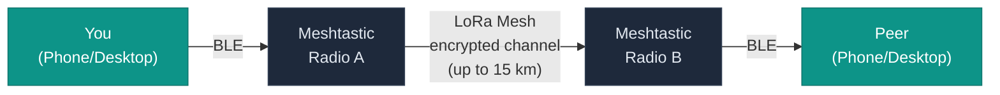
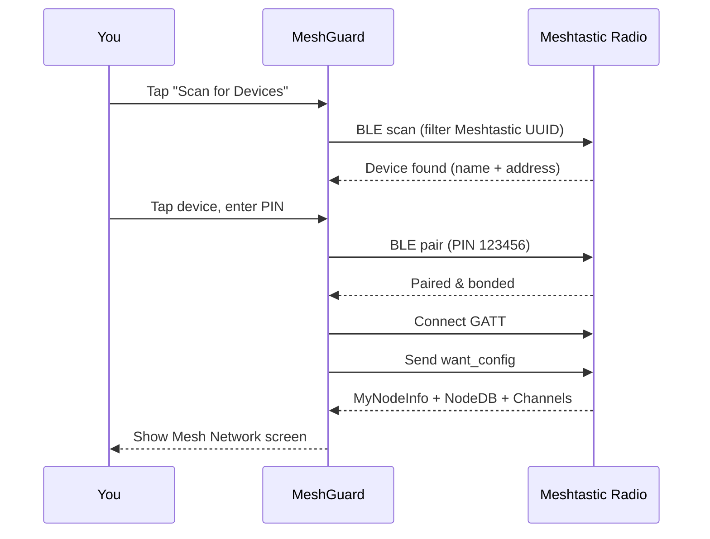
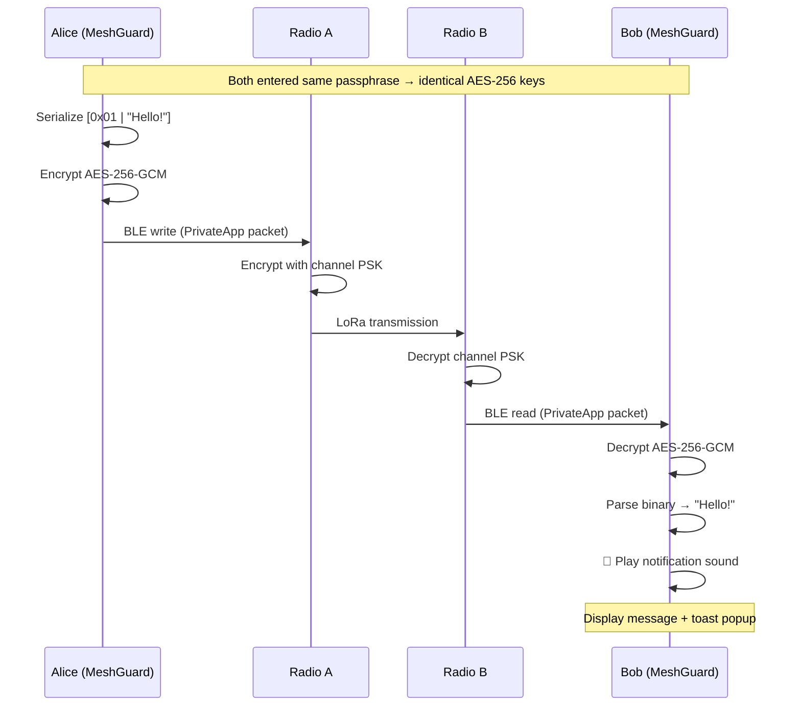
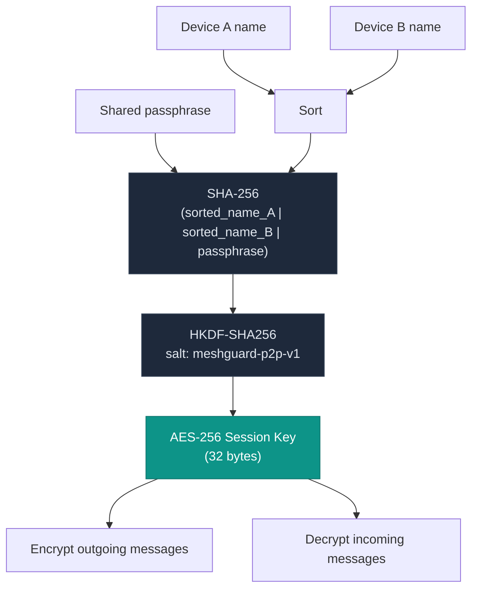
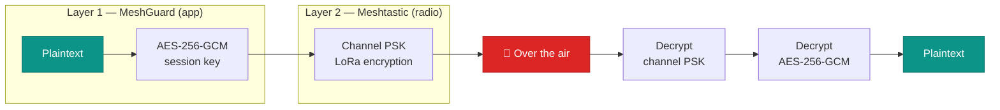
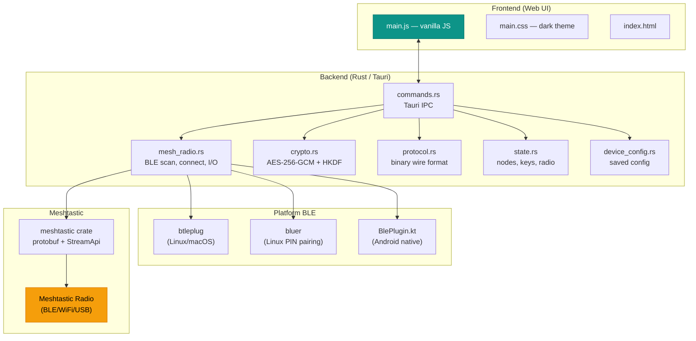

# MeshGuard — Secure P2P Mesh Messenger

Privacy-first encrypted peer-to-peer messenger for [Meshtastic](https://meshtastic.org/) devices. No internet, no servers, no accounts. MeshGuard connects to your Meshtastic radio via Bluetooth, discovers other mesh nodes, and lets you start encrypted conversations using a shared passphrase — nothing secret ever travels over the air.



## Features

- **BLE device scanning** — discovers nearby Meshtastic devices (SenseCAP, T-Beam, Heltec, RAK, etc.)
- **PIN-based BLE pairing** — handles Bluetooth pairing with PIN entry (default `123456`)
- **Mesh node discovery** — sees all nodes on the mesh network in real time
- **Passphrase-based chat** — tap a node, enter a shared passphrase, start chatting
- **End-to-end encryption** — AES-256-GCM with deterministic key derivation (HKDF-SHA256)
- **No key exchange over the air** — both peers derive identical keys locally from the passphrase
- **Compact binary protocol** — messages fit within Meshtastic's ~228-byte LoRa payload limit
- **Notification sounds** — audible alert + popup toast for incoming messages, with custom sound support
- **Cross-platform** — Android, Linux (deb/rpm/AppImage), macOS
- **WiFi & USB serial** — connect to Meshtastic devices over TCP or serial, not just Bluetooth
- **Dark theme, mobile-first UI** — designed for field use

## Downloads

Grab the latest build from [**Releases**](https://github.com/nemke82/meshguard/releases).

| Platform | File | Install |
|----------|------|---------|
| Android | `.apk` | Enable "Install from unknown sources", open the APK |
| Ubuntu / Debian | `.deb` | `sudo dpkg -i meshguard_*.deb` |
| RHEL / Fedora | `.rpm` | `sudo dnf install meshguard-*.rpm` |
| Linux (any) | `.AppImage` | `chmod +x MeshGuard-*.AppImage && ./MeshGuard-*.AppImage` |
| macOS | `.dmg` | Open the DMG, drag MeshGuard to Applications |

---

## Quick Start

### What You Need

- **2 Meshtastic devices** (SenseCAP T1000, T-Beam, Heltec, RAK, or any Meshtastic-compatible radio)
- **2 phones or computers** running MeshGuard
- Bluetooth enabled on both
- Both radios on the **same Meshtastic channel** and **same region frequency** (e.g., both EU868 or both US915)

### Step 1 — Scan & Connect

1. Open MeshGuard and tap **Scan for Devices**
2. Your Meshtastic radio will appear in the list — tap it
3. Enter the BLE pairing PIN (default `123456`) and tap Connect
4. MeshGuard connects, reads the device configuration, and loads the mesh node list

### Step 2 — Start a Secure Chat

1. On the **Mesh Network** screen, you'll see all discovered nodes
2. Tap the peer you want to chat with
3. Enter a **shared passphrase** that you and your peer agreed on beforehand (in person, phone call, etc.)
4. MeshGuard derives an AES-256 encryption key from both device identities + passphrase
5. You're in — type and send encrypted messages

### Step 3 — On the Other Side

Your peer does the same: scans, connects to their radio, taps your node, enters the **same passphrase**. Both sides derive identical keys — no key exchange needed.

---

## How It Works

### Connection Flow



### Message Exchange



### Key Derivation



### Double Encryption Layers



---

## Security Model

| Layer | Protection |
|-------|-----------|
| Message encryption | AES-256-GCM (authenticated, 256-bit key) |
| Key derivation | HKDF-SHA256 from sorted device identities + passphrase |
| Wire format | Compact binary (1 byte type + payload), encrypted once |
| Key exchange | **None over the air** — keys derived locally from shared secret |
| Channel encryption | Meshtastic PSK (LoRa-layer encryption, device to device) |
| Memory safety | Written in Rust — no buffer overflows; keys zeroized on drop |
| Passphrase handling | Never stored, never transmitted, cleared after use |
| Transport | LoRa mesh — no internet, no servers, no DNS |
| MQTT/uplink | Disabled — no data leaves the mesh |

---

## Architecture

Built with [Tauri 2.0](https://tauri.app/) — Rust backend + web frontend.



### Project Structure

```
meshguard/
├── src-tauri/
│   ├── src/
│   │   ├── lib.rs             # Tauri app entry point
│   │   ├── main.rs            # Binary entry point
│   │   ├── mesh_radio.rs      # BLE scan, connect, polling stream, message I/O
│   │   ├── ble_plugin.rs      # Native Android BLE plugin (Kotlin bridge)
│   │   ├── crypto.rs          # AES-256-GCM + HKDF-SHA256 key derivation
│   │   ├── protocol.rs        # Compact binary wire format for mesh messages
│   │   ├── commands.rs        # Tauri IPC commands (scan, connect, chat, pair)
│   │   ├── device_config.rs   # Saved device/peer configuration
│   │   ├── state.rs           # Shared app state (nodes, keys, radio)
│   │   └── error.rs           # Error types
│   ├── Cargo.toml
│   └── tauri.conf.json
├── ui/
│   ├── src/
│   │   ├── main.js            # UI logic: Connect → Mesh → Passphrase → Chat
│   │   └── styles/main.css    # Dark theme, mobile-first
│   ├── index.html
│   └── package.json
├── scripts/
│   └── patch-android.sh       # Patches Android build for BLE permissions + native plugin
└── .github/workflows/
    ├── ci.yml                 # Check + test + clippy on push/PR
    └── release.yml            # Build all platforms on tag push
```

### Platform-Specific BLE

| Platform | BLE Stack | Notes |
|----------|-----------|-------|
| Linux | `btleplug` + `bluer` | btleplug for GATT, bluer for PIN-based BlueZ pairing via D-Bus agent |
| macOS | `btleplug` | CoreBluetooth backend |
| Android | Native Kotlin plugin | Custom `BlePlugin.kt` injected via `patch-android.sh` — handles scan, GATT connect, bonding, read/write |

---

## Building from Source

### Prerequisites

- [Rust](https://rustup.rs/) (stable)
- [Node.js](https://nodejs.org/) 20+
- [Tauri CLI](https://tauri.app/) — `cargo install tauri-cli --version "^2"`

**Linux (Ubuntu/Debian):**
```bash
sudo apt install libwebkit2gtk-4.1-dev libappindicator3-dev librsvg2-dev \
  patchelf libdbus-1-dev pkg-config libssl-dev
```

**Linux (RHEL/Fedora):**
```bash
sudo dnf install gcc gcc-c++ webkit2gtk4.1-devel libappindicator-gtk3-devel \
  librsvg2-devel patchelf dbus-devel openssl-devel pkg-config rpm-build
```

**macOS:**
```bash
xcode-select --install
```

### Build & Run

```bash
cd ui && npm install && cd ..

# Desktop development
cargo tauri dev

# Desktop release
cargo tauri build

# Android
cargo tauri android init
bash scripts/patch-android.sh
cargo tauri android dev     # dev on connected device
cargo tauri android build   # release APK
```

### Creating a Release

Tag with a date version — CI builds all platforms automatically:
```bash
git tag v2026.03.29
git push origin v2026.03.29
```

Produces: Android APK, .deb, .rpm, .AppImage, macOS .dmg, plus SHA256 checksums.

---

## Supported Devices

MeshGuard works with any Meshtastic-compatible radio, including:

- **SenseCAP T1000** / T1000-E
- **LilyGO T-Beam** / T-Beam Supreme
- **Heltec LoRa 32** / V3 / Wireless Tracker
- **RAK WisBlock** (RAK4631, RAK11200)
- **Station G2**
- Any device running Meshtastic firmware 2.x

---

## Troubleshooting

| Problem | Solution |
|---------|----------|
| No devices found on scan | Make sure Bluetooth is on, device is powered, and within ~10m range |
| PIN rejected | Default Meshtastic PIN is `123456`. Check your device's Bluetooth settings |
| Connection timeout | Try scanning again. On Linux, ensure `bluetoothd` is running |
| Messages not arriving | Both radios must be on the same channel + region. Re-enter passphrase on both sides |
| "No session" error | Passphrase hasn't been entered this session. Tap the peer and re-enter it |
| Short range | Use Long Range modem preset. Elevate devices. Use external antenna if available |

### Tips for Best Range

- **Elevation** — place Meshtastic radios as high as possible
- **Line of sight** — LoRa reaches 15+ km over water/flat terrain, 2–5 km in urban areas
- **External antenna** — dramatically improves range on supported devices
- **Long Range modem preset** — trades speed for maximum distance
- **Message length** — keep messages under 160 characters for reliable single-packet delivery

---

## Contributing

Pull requests welcome. Run checks before submitting:

```bash
cd src-tauri && cargo clippy -- -D warnings && cargo test
```

## License

MIT
